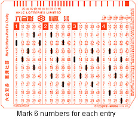

# Mark-six
## 1. Introduction 

	### (1) Background information

Mark Six is a lottery-style game where players guess what numbers will be drawn out of a lottery machine. The lottery machine is a transparent plastic cylinder which contains coloured Red, Blue and Green balls with numbers 1 to 49. The cylinder is rotated to provide randomisation in the drawing process. Each drawing occurs on 9:30PM (Hong Kong Time) every Tuesday, Thursday, and Sunday (or Saturday if horse races occurs on Sunday), while bets are accepted until 15 minutes prior to the drawing.

Players choose six numbers or more at Jockey Club website or betting station out of a possible 49. Each selection of the numbers costs 10 HKD and is one selection of the results of the lottery draw. In the draw, seven numbers are drawn. The first six numbers drawn are called the "drawn numbers". The last one drawn is called the "extra number". Often, in Cantonese this number is called a 'half number'.

### (2) Design rationale

​	The goal of the program is to get the random number from 1 to 49, and in the mark-six we will have 7 different numbers, from the 1-6 is the normal mark-six number and the 7th number is the special number. 

​	The first goal it to generate the random number, we use the **random** to get the random number from 1 to 49, then I put it into a list called **list1** to store the result get from the random number generator.

​	The last step is to print the result on the screen, this step we use the **print** function to show it on the screen.

### (3) Sample output

The First of mark six number is :
1
The Second of mark six number is :
44
The Third of mark six number is :
25
The Fourth of mark six number is :
40
The Fifth of mark six number is :
47
The Sixth of mark six number is :
41
The special number of mark six number is :
6

###(4) The Reference

[1] https://en.wikipedia.org/wiki/Mark_Six

